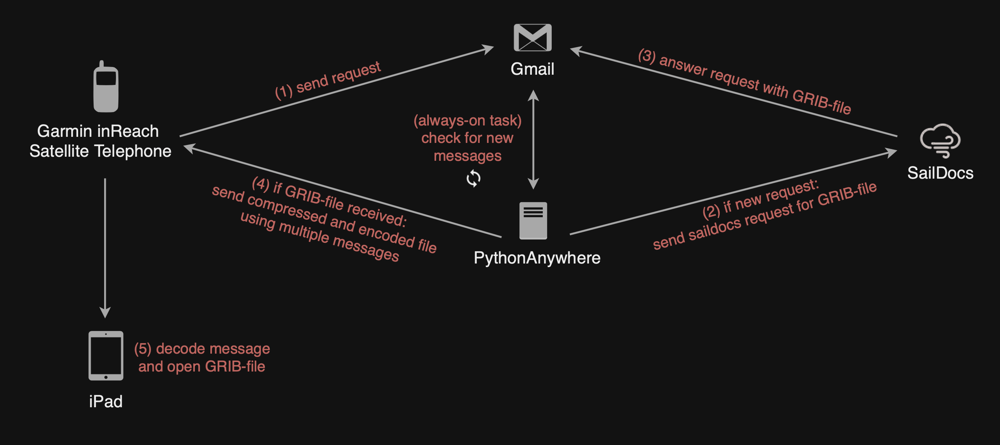
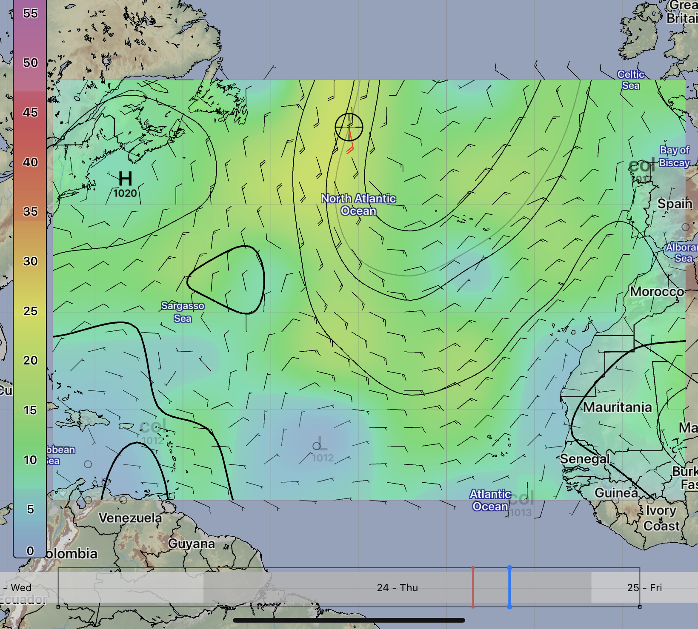

# Marine GRIB InReach Service

## Overview

This project enables sailors to request and receive GRIB weather data over a Garmin inReach device, even without internet access. It provides a cost-effective alternative to solutions like IridiumGo by leveraging email APIs and efficient data encoding.

The workflow is illustrated below:  

Credit: [Rhycus/GRIB-via-inReach](https://github.com/rhycus/GRIB-via-inReach) and  [tabeaeggler/MarineGRIB-InReach-Transmitter](https://github.com/tabeaeggler/MarineGRIB-InReach-Transmitter) for the original concept and excellent work. This project slghtly improves overall robustness and includes additional features like Mistral AI chat for offshore use.

---

## Features

- Request GRIB files via inReach SMS/email.
- Automated Gmail polling and Saildocs integration.
- Efficient GRIB file compression and base64 encoding.
- Message chunking for reliable inReach transmission.
- Jupyter Notebook decoder for reconstructing GRIB files.
- Easily extensible and configurable.

This update also adds a Mistral AI chat feature enabling InReach users to ask questions while offshore.
---

## Prerequisites

- **Garmin inReach:** Active subscription (unlimited messaging recommended). [Garmin inReach](https://www.garmin.com/en-US/p/837461/pn/010-06005-SU)
- **Gmail Account:** Dedicated account with Gmail API enabled. Download `credentials.json` and set release status to production. [Gmail API Quickstart](https://developers.google.com/gmail/api/quickstart/python)
- **Hosting:** PythonAnywhere or similar service to run the script.
- **Device:** Tablet or computer with Jupyter Notebook and a GRIB viewer app.

---

## Setup

### 1. Clone the Repository
git clone https://github.com/yourusername/MarineGRIB-InReach-Transmitter.git cd MarineGRIB-InReach-Transmitter

### 2. Install Dependencies
Install Python packages from `requirements.txt`: pip install -r requirements.txt

### 3. Configure Environment Variables
Create a `.env` file in the project root (see `.env.example` for template): cp .env.example .env

Edit `.env` and fill in your credentials and settings.

**Do not commit `.env` to version control.**  
Add `.env` to your `.gitignore`.

### 4. Set Up Gmail API

- Place your `credentials.json` in the project root.
- The script will generate `token.pickle` on first run.

---

## Usage

### Requesting a GRIB File

Send a message from your inReach device to your dedicated Gmail address in the following format:
ecmwf:24n,34n,72w,60w|8,8|12,48|wind,press

- **Model:** `ecmwf`
- **Lat/Lon:** `24n,34n,72w,60w`
- **Grid:** `8,8`
- **Times:** `12,48`
- **Parameters:** `wind,press`

### Receiving and Decoding

- The service polls Gmail, forwards requests to SailDocs, and receives GRIB files.
- Files are compressed, base64-encoded, split into 120-character messages, and sent back via inReach.
- On your device, copy received messages into the provided Jupyter Notebook (`InReach_Message_Decoder.ipynb`) to reconstruct the GRIB file.
- Open the GRIB file in a viewer app (LuckGrib recommended).

---

## Example: Atlantic Crossing

**Request:**
ecmwf:44n,10n,75w,10w|8,8|12,48|wind,press

**Result:**  

---

## Notes

- **Message Length:** Each message is capped at 120 characters to avoid truncation.
- **Encoding:** Base64 is used for safe transmission. Base85 is possible but may cause issues with special characters.
- **APIs and Libraries:** The project depends on several APIs and libraries. Review and update dependencies as needed.

---

## Contributing

Feel free to use, modify, and contribute. Always review code and configuration before use. Proceed at your own risk.

